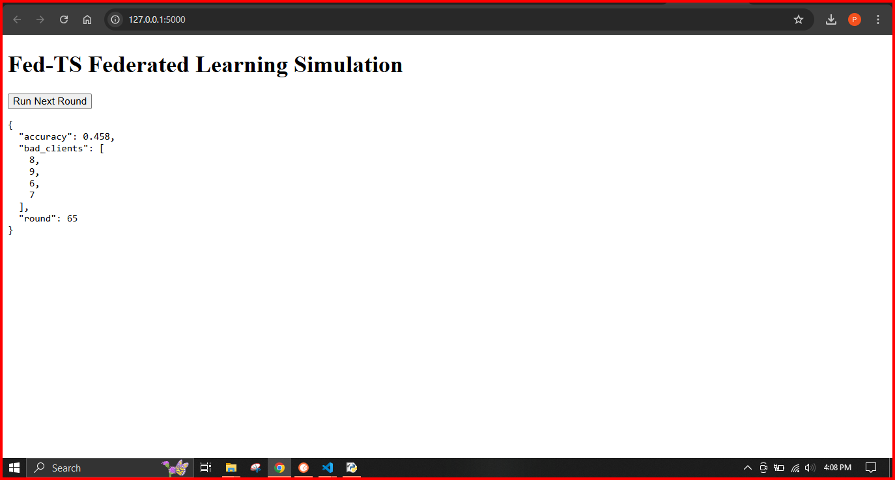

# 🧠 Federated Learning with Fed-TS (Flask Dashboard)

A beginner-friendly interactive simulation of Federated Learning using **Thompson Sampling (Fed-TS)** to dynamically select trustworthy clients and block malicious ones.

---

## 📌 Project Title

**Dynamic Federated Learning using Fed-TS with Client Trust Evaluation via Flask Dashboard**

---

## 🌍 Tech Stack

- **Programming Language**: Python 3
- **Libraries Used**:
  - [Flask](https://flask.palletsprojects.com/) → for the web dashboard
  - [PyTorch](https://pytorch.org/) → to define and train the neural network
  - [TorchVision](https://pytorch.org/vision/stable/index.html) → for loading the MNIST dataset
  - [scikit-learn](https://scikit-learn.org/) → for KMeans clustering
  - [NumPy](https://numpy.org/) → for math and array operations
  - [Matplotlib](https://matplotlib.org/) (optional) → for plotting results

---

## 🔍 Problem Statement

In traditional **Federated Learning (FL)**:
- Clients are selected randomly
- Some clients may contain noisy, mislabeled, or malicious data

❗ This can degrade the global model’s performance.

### ✅ Solution: Fed-TS (Thompson Sampling)
We introduce a smarter way to select clients by:
- Tracking **client reliability** using Bayesian sampling
- Preferring clients with **low drift** (minimal disruption to global model)
- **Automatically blacklisting** clients after repeated suspicious behavior

---

## 🧠 Project Structure (Code Walkthrough)

### 1. **Setup**
We initialize a simple Flask app:
```python
app = Flask(__name__)



